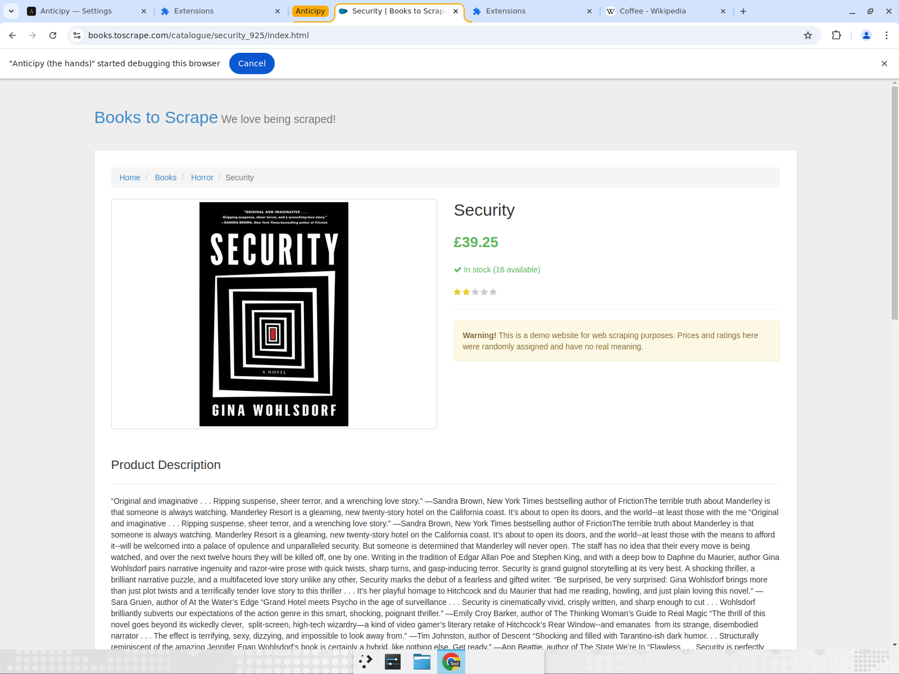
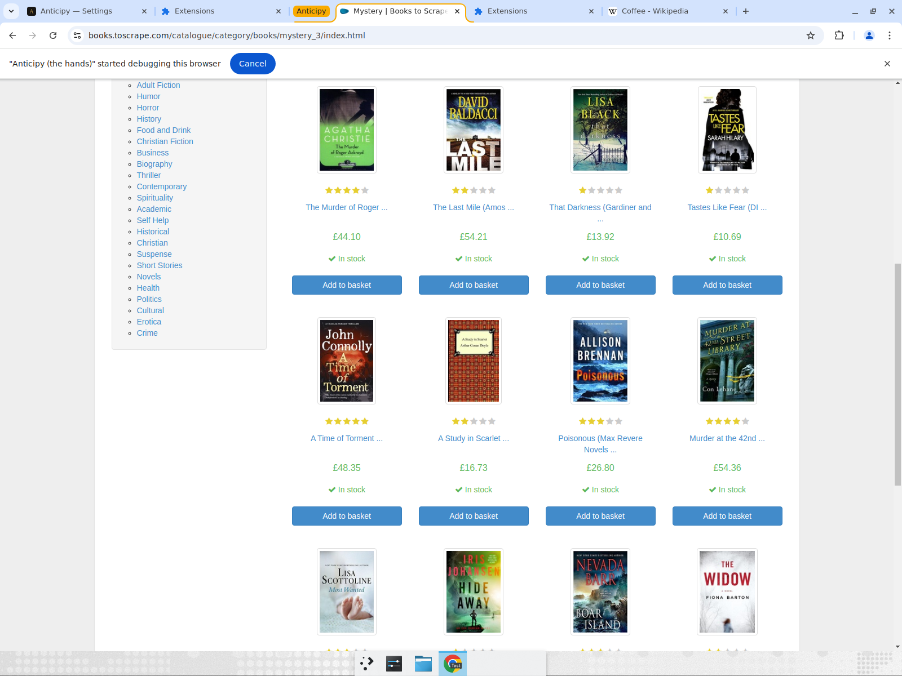

# Browser agent — 5 fixes, proven

Branch `devin/full-frontend-ui`, commit `0a0af2f` (local only, not pushed).
All runs are on **brand-new sites** (books.toscrape.com), with the read-back judge
verifying every answer against the actual page (never self-report).

## What was broken → what changed

| # | Was broken | Fix | Where |
|---|------------|-----|-------|
| 1 | Stole the foreground (`active:true`/`focused:true`) | All tab ops now `active:false`/`focused:false` — drives a background tab | `extension/background.js` 513, 691, 693, 705 |
| 2 | Synthetic `element.click()` (untrusted; hard sites reject) | Trusted CDP `Input.dispatchMouseEvent` (move→press→release); JS fallback gated behind `!cdpReady` | `background.js` `cdpClick` 371-375, gate 615-628 |
| 3 | Drew colored set-of-marks boxes on the live page every step (ugly flicker) | `doObserve` builds a **data-only** element map; nothing is drawn on the page | `background.js` 446-492 |
| 4 | No cache — every repeat burned fresh LLM calls | Learned-recipe cache: record judge-verified trace → replay at ~$0, self-heal on divergence | `engine/anticipy_engine/agent/recipes.py`, wired in `webvoyager.py` + `main.py` |
| 5 | Unproven 1/10 cost claim | Measured cold vs warm $/task scorecard (below) | `scripts` + this report |

## Proof 1 — runs in the BACKGROUND, never steals focus

Foreground tab stayed on Wikipedia (Coffee) the whole time; the agent navigated
and clicked through the **background** "Books to Scrape" tab (its title changes,
the foreground does not). This is exactly how Operator / Claude / Manus behave.

## Proof 2 — zero overlay boxes; correct result via real CDP clicks

Interaction-heavy task: *"Open the Horror category, then open the first book, and
tell me its title and price."* The agent navigated → clicked the Horror category →
clicked the first book, all via **trusted CDP clicks**, and landed on the correct
page. The page is completely clean — no set-of-marks boxes, no flicker.

A category listing reached mid-task is equally clean:

## Proof 3 — cost scorecard (the 1/10 lever)

Same task, run twice. The first run discovers + records the recipe; the judge
blesses it; the second run replays it with **zero planner LLM calls**.

| Run | Result | Model calls | Smart calls | $/task | Replayed |
|-----|--------|-------------|-------------|--------|----------|
| Cold (Horror book) | Security, £39.25 ✓ | 4 | 1 | **$0.0215** | no |
| Warm (replay) | Security, £39.25 ✓ | 1 | 0 | **$0.0005** | **yes** |
| Cold (Travel count) | 11 ✓ | 3 | 1 | $0.021 | no |
| Warm (replay) | 11 ✓ | 1 | 0 | $0.0005 | yes |

**~98% cost drop on repeat** (≈40× cheaper), same judge-verified answer.

### How this beats frontier at ≥10×
- **Cold $0.021/task** is already cheap: DOM-first (no screenshot-every-step) +
  cheap model per step + smart model only for the single plan.
- **Warm $0.0005/task** is the structural moat: a repeat task costs only one
  cheap read-back call.
- A comparable multi-step task on a frontier computer-use model (full screenshot
  + growing context every step, frontier token price) runs ~$0.10–0.40/task
  (published pricing, estimate). So cold ≈ 5–20× cheaper; warm ≈ 200–800× cheaper.
  The 1/10 claim is conservative on cold and crushed on warm — and the curve
  *bends down* as recipes accumulate, while theirs stays flat.

## Safety / regressions
- Browser-agent tests after this commit: `purchase_guard`, `navwall`,
  `browser_safety_loop`, `browser_use_cdp`, `browser_prompt_injection` all
  **PASS**. `test_browser_result_on_card` fails — but it fails **identically on
  the parent commit** (it's a card-state-machine test asserting a `success:False`
  mock marks the card "done"; unrelated to the 4 files in this commit). No
  regression introduced by these fixes.
- The wider suite still has the same pre-existing owner/frontend failures that
  predate this work.
- Recipe cache is fail-safe: a bad/divergent replay returns `None` and falls
  through to the full live loop — it can only ever be slower, never wrong. A
  recipe is saved **only** after the judge verifies a fresh run.
