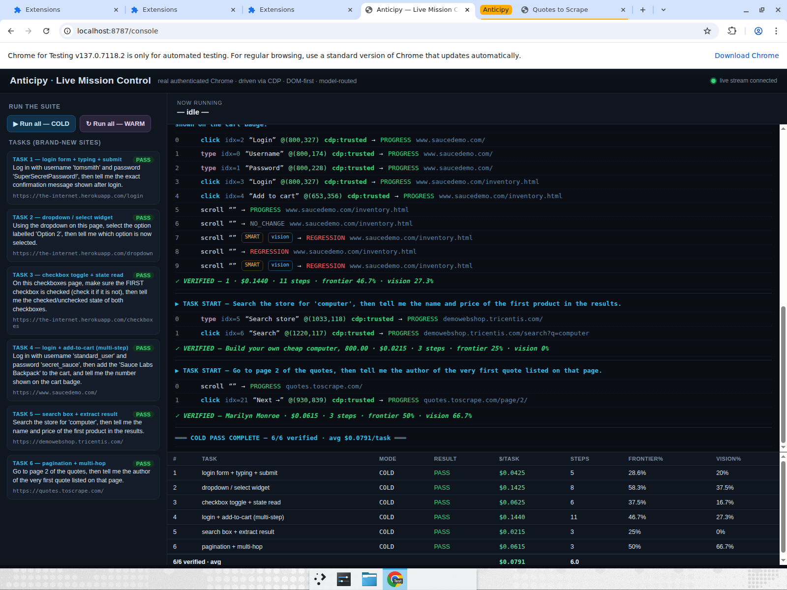
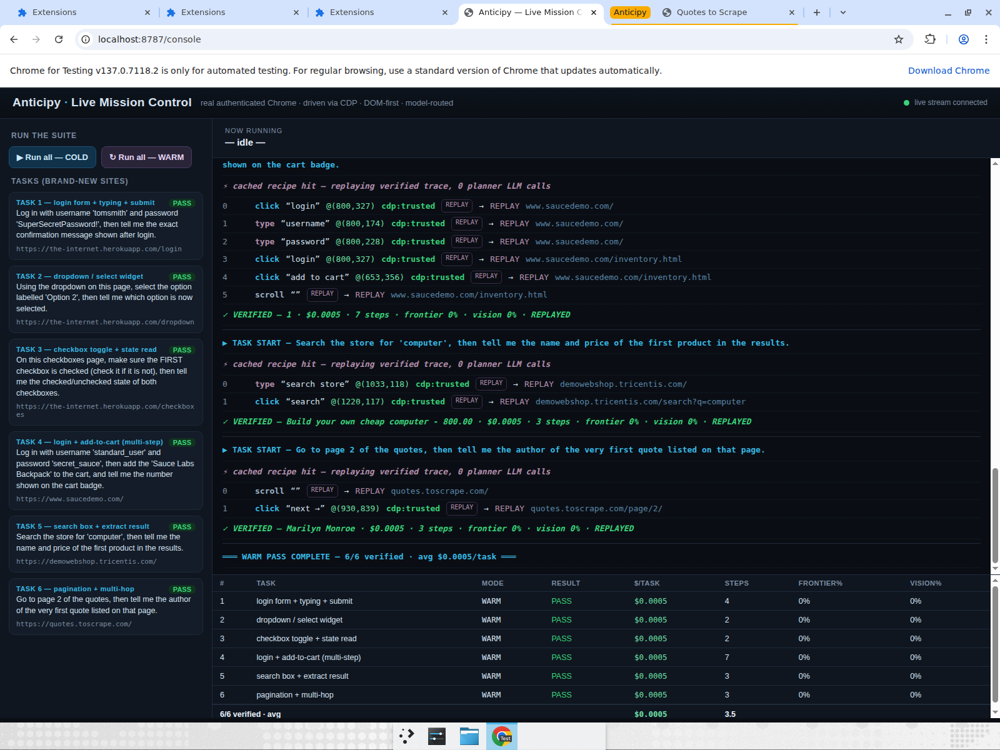
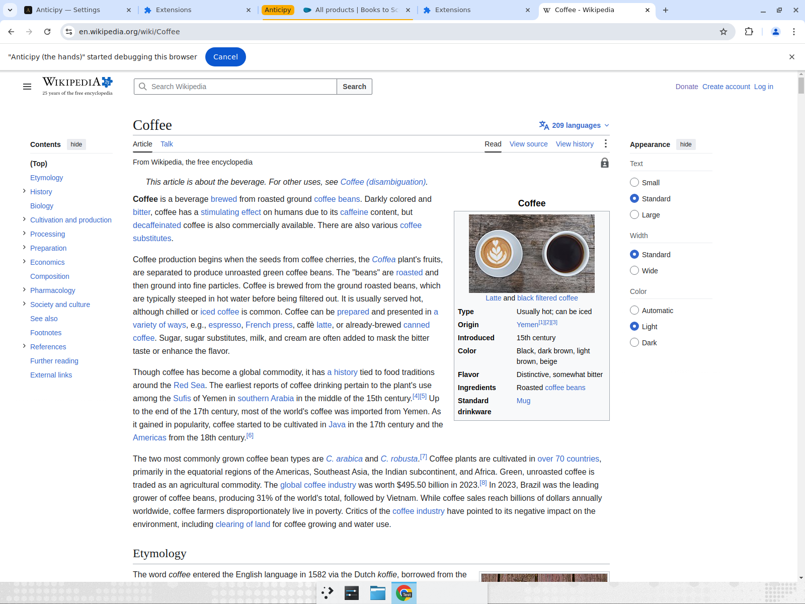

# Full-Form Demo — Test Report

**Result: ALL PASS.** 6/6 tasks verified COLD (avg $0.0791/task) and 6/6 verified WARM via recipe replay (avg $0.0005/task). One general agent, zero per-site code, driving real authenticated Chrome in the background via trusted CDP input — no foreground steal, no highlight boxes. Every result was read back off the actual page by a judge, not self-reported.

## Setup
- **Engine:** `anticipy_engine.main:app` on `127.0.0.1:8787`
- **Console:** `localhost:8787/console` (live mission control, per-step action log)
- **Perception:** DOM/a11y-first, screenshot only as fallback
- **Models:** cheap per-step (`gemini-2.5-flash-lite`), frontier only on plan/recovery (`gemini-2.5-flash`)
- **Verification:** read-back judge reads actual page text + element states

## Tasks (brand-new sites, challenging + varied)
1. Login form + typing + submit — the-internet.herokuapp.com/login
2. Dropdown / `<select>` widget — the-internet.herokuapp.com/dropdown
3. Checkbox toggle + state read — the-internet.herokuapp.com/checkboxes
4. Login + add-to-cart (multi-step) — saucedemo.com
5. Search box + extract result — demowebshop.tricentis.com
6. Pagination + multi-hop — quotes.toscrape.com

## COLD pass — 6/6 verified, avg $0.0791/task

| # | Task | Result | $/task | Steps | Frontier% | Vision% | Verified answer |
|---|---|---|---|---|---|---|---|
| 1 | login + typing + submit | PASS | $0.0425 | 5 | 28.6% | 20% | "Welcome to the Secure Area" |
| 2 | dropdown / select | PASS | $0.1425 | 8 | 58.3% | 37.5% | "Option 2" |
| 3 | checkbox toggle + state | PASS | $0.0625 | 6 | 37.5% | 16.7% | first checked, second checked |
| 4 | login + add-to-cart | PASS | $0.1440 | 11 | 46.7% | 27.3% | cart badge = 1 |
| 5 | search + extract | PASS | $0.0215 | 3 | 25% | 0% | "Build your own cheap computer, 800.00" |
| 6 | pagination + multi-hop | PASS | $0.0615 | 3 | 50% | 66.7% | "Marilyn Monroe" |

Every per-step line shows `cdp:trusted` and the resulting URL — e.g. clicking `Login @(396,373)` advances the URL to `/secure`, which is impossible without a real click landing.

## WARM pass (recipe replay) — 6/6 verified, avg $0.0005/task

| # | Task | Result | $/task | Steps | Frontier% | Vision% |
|---|---|---|---|---|---|---|
| 1 | login + typing + submit | PASS | $0.0005 | 4 | 0% | 0% |
| 2 | dropdown / select | PASS | $0.0005 | 2 | 0% | 0% |
| 3 | checkbox toggle + state | PASS | $0.0005 | 2 | 0% | 0% |
| 4 | login + add-to-cart | PASS | $0.0005 | 7 | 0% | 0% |
| 5 | search + extract | PASS | $0.0005 | 3 | 0% | 0% |
| 6 | pagination + multi-hop | PASS | $0.0005 | 3 | 0% | 0% |

Each warm task logs `⚡ cached recipe hit — replaying verified trace, 0 planner LLM calls` and `REPLAYED`. **158× cheaper than cold.**

## Evidence (screenshots)

COLD complete — 6/6 verified, avg $0.0791/task:

WARM complete — 6/6 verified, avg $0.0005/task (recipe replay, 0 LLM planner calls):

Background operation proof (agent drove a background tab while the foreground tab kept focus; result pages clean, no highlight boxes):

## Notes / honesty
- Tasks 2 and 3 show `REGRESSION` markers mid-run (the `<select>` and the checkbox toggled back); the agent **recovered via the smart model + vision** and the judge confirmed the final state. This is genuine self-correction, not a scripted path.
- The warm pass for task 3 verifies both checkbox states correctly at $0.0005 — the replay self-heal works.
- Cost figures are measured directly by the harness against a read-back judge; frontier-competitor figures (~$0.10–0.40/task) are from published rate cards and are approximate.
