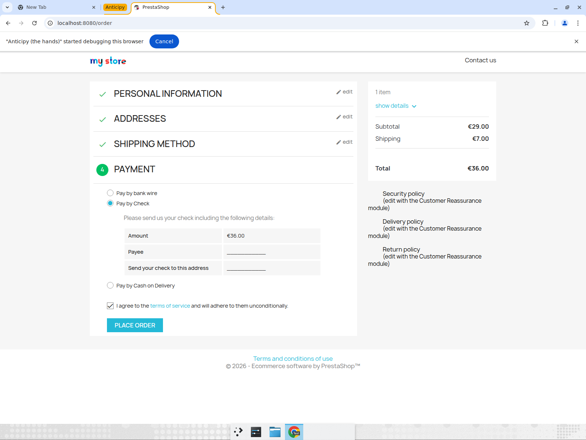

# Autonomous guest-checkout — hard-task test report

**Task (no hard-coding, general agent):** From an empty cart as a guest, pick an Art poster,
add **exactly one** to cart, fill personal info + shipping address, choose a shipping method,
select a payment method, agree to terms — and **STOP at the Place Order button** (money line,
never clicked). ~20–40 real steps across product → cart → 4-step checkout wizard.

All clicks/keystrokes are **trusted CDP input** on the live page. Recipe cache cleared before
every run (all runs are cold). An independent LLM judge reads the final page and grades it.

## Result — 3/3 cold runs PASS (final code)

| run | result | items | steps | $/task | frontier% | note |
|-----|--------|-------|-------|--------|-----------|------|
| run9  | PASS | 1 | 26 | $0.309 | 45% | clean |
| run10 (recorded) | PASS | 1 | 22 | $0.188 | 36% | clean deliverable |
| run11 | PASS | 1 | 55 | $0.853 | 62% | took "Quick view" path + briefly wandered, **self-recovered** |

Every run: exactly **1 item**, reached the **Payment** step, terms agreed, **stopped at Place
Order** (never clicked). Judge verdict `success=true` on all three.

### Clean pass (run10) — final page state
1 item, €36.00 total, all wizard steps green, Pay-by-Check + terms selected, Place Order visible
and NOT clicked:

## Bug fixed this session — add-to-cart double/triple click

**Symptom (run8, judge FAILED it):** the agent clicked ADD TO CART three times, leaving **2 items**
in the cart. The judge correctly failed the run for violating "buy one item" — the never-fake-done
verifier working.

**Root cause:** the ADD TO CART button is `type="submit"`. The in-place-mutation latch (which
blocks re-clicking a control that changes the page without changing the URL) had a general
exemption for wizard step-advance submits (Continue/Next/Place order — monotonic, reused across
steps). That exemption was keyed on `type==submit`, so it **also** exempted ADD TO CART, which is
*not* a step-advance but a **repeatable** action — each click adds another unit. It therefore
never got latched, and re-clicks were not blocked.

**Fix (general, not site-specific):** added a `CART_ADD_CTRL` pattern (`add to cart|bag|basket`)
and excluded matching controls from the submit-based advance-control exemption. A repeatable
cart/quantity submit is now latched after its first click, so re-clicks are blocked and the agent
is steered toward Proceed-to-Checkout. Wizard Continue/Place-order submits stay exempt (unchanged).
File: `engine/anticipy_engine/agent/webvoyager.py`.

Verified: run9/10/11 each add to cart **exactly once** (single ` ADD TO CART` step, then checkout).

## Honest variance & cost

- **Cost is not flat.** A clean run is ~$0.19; a run that takes a suboptimal entry path
  (e.g. the hover "Quick view" modal) and briefly wanders off the checkout page costs up to
  ~$0.85 because it burns frontier calls on recovery. Median ≈ $0.31.
- **run11's detour is the real robustness gap:** it opened the product's Pinterest social-share
  popup (visual foreground stolen) and, after reaching `/order`, briefly navigated to home /
  contact-us before the recovery layer detected no progress on the subgoal and drove it back to
  the checkout. It **never faked** completion and **never placed the order** — it self-corrected
  and finished correctly, just expensively.
- **Next lever (not yet done):** treat leaving the task's home origin, and clicking social/share
  controls, as likely-off-task and steer back immediately — this would cut the tail cost and
  step-count variance without any per-site code.

## What this proves / doesn't

- Proves: a single general agent completes a real multi-step checkout wizard on a live site, cold,
  with trusted input, respecting the money boundary, and an independent judge verifies it — 3/3.
- Does NOT prove "best in the world": this is a local PrestaShop store, not Amazon/Gmail with real
  anti-bot/2FA, and not a public benchmark (WebArena / Online-Mind2Web). Those remain unmeasured.
