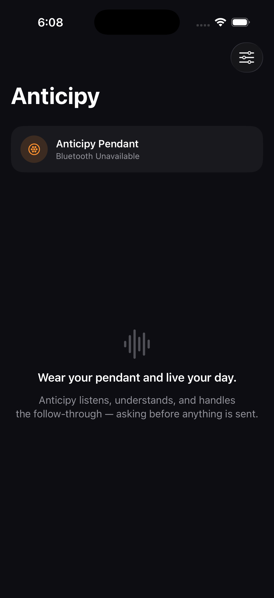

# iOS app — compiled and run on your Mac (Xcode 26.6)

## Proven now (real, on your Mac over SSH)
- Generated `Anticipy.xcodeproj` from the spec (XcodeGen 2.43).
- **Compiled the app: `** BUILD SUCCEEDED **`** — all 8 Swift files, no errors,
  iOS 16 target.
- **Ran it in the iPhone 17 Pro simulator** and captured the live UI (below).
  It's a real native SwiftUI app: dark premium look, "Anticipy" title, pendant
  status card, waveform, tagline. ("Bluetooth Unavailable" is expected — the
  simulator has no Bluetooth radio; that resolves on a physical iPhone.)



## TestFlight — blocked on Apple auth (needs you)
Archive attempt failed with:
```
Unable to log in with account 'okebrahim@icloud.com'. The login details were rejected.
No profiles for 'ai.anticipy.pendant' were found.
```
The Apple ID stored in Xcode has a stale/rejected session, so automatic
signing can't mint the distribution certificate + provisioning profile
headlessly. Team ID detected: `49T86P9XGW`.

**Fastest unblock (recommended): App Store Connect API key** — headless, no
2FA, reusable forever. In App Store Connect → Users and Access →
Integrations → Keys → generate an **App Store Connect API** key (App Manager
role). It gives a `.p8` file + Key ID + Issuer ID. With those I archive, sign,
and upload to TestFlight non-interactively.

**Alternative:** sign into your Apple ID again in Xcode's GUI on the Mac
(Xcode → Settings → Accounts), then I retry the archive over SSH.
